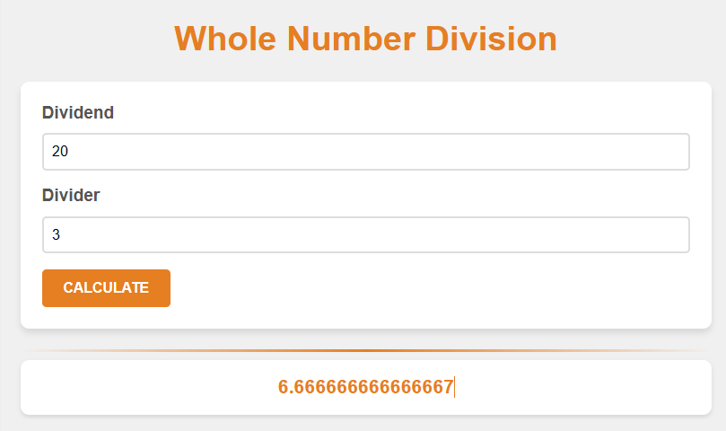

# DJS02 Project Brief: Whole Number Divider

This project focuses on enhancing a web-based Whole Number Divider application. It's designed to help students apply their knowledge of error handling, guided by specific user stories. Below is the HTML and JavaScript code for a “Whole Number Divider”. 

## Project Overview

The existing codebase for the Whole Number Divider meets certain user stories but falls short on others. My task was to modify and extend the code to address all specified user stories, ensuring a robust, user-friendly application.

## Starter Code

The provided HTML and JavaScript setup a basic form for inputting two numbers (dividend and divider) and a button to perform the calculation. The current script captures form submissions and displays the division result. However, it lacks validation, error handling, and the logic to meet all user stories.

<h2 style="color:#e67e22">Resolved Stories</h2>

1. **Initial State**: On page load, the message “No calculation performed” is displayed, indicating no action has been taken yet.
2. **Whole Number Division**: Upon submitting two numbers that divide evenly (e.g., 20 divided by 10), the application correctly displays the whole number result.

## Senario's:
### Scenario 1: Starting program state

- GIVEN that the submit button has not been pressed yet
- AND the code has just loaded
- THEN “NO calculation performed” should be displayed at the bottom

### Scenario 2: Dividing numbers result in a whole number

- GIVEN that the submit button is pressed
- WHEN 20 is entered into the first input
- AND 10 is entered into the second input
- THEN 2 should be displayed at the bottom
 
<h2 style="color:#e67e22">Unresolved Stories</h2> 

### Scenario 3: Dividing numbers result in a decimal number

- GIVEN that the submit button is pressed
- WHEN 20 is entered into the first input
- AND 3 is entered into the second input
- THEN the number 6 with no decimal should be shown
 

### Scenario 4: Validation when values are missing

- GIVEN that the submit button is pressed
- WHEN either or both inputs are empty
- THEN the divisions should not be done
- AND the following should be displayed: “Division not performed. Both values are required in inputs. Try again”.
 

### Scenario 5: An invalid division should log an error in the console

- GIVEN that the submit button is pressed
- WHEN 20 is entered into the first input
- AND 0 is entered into the second input
- THEN the division should not be done
- AND the following should be displayed: “Division not performed. Invalid number provided. Try again”.
- AND an error should be logged in the browser console that shows the call stack
- BUT the program should not crash entirely
 

### Scenario 6: Providing anything that is not a number should crash the program

- GIVEN that the submit button is pressed
- WHEN ‘YOLO’ is entered into the first input
- AND ‘+++’ is entered into the second input
- THEN the entire screen should be replaced with “Something critical went wrong. Please reload the page
- AND an error should be logged in the browser console that shows the call stack.

## Task Instructions

1. **Review the Starter Code**: Understand the current implementation and its limitations.
2. **Implement User Stories**: Modify the code to fulfill all unresolved user stories. Pay attention to error handling and user input validation.
3. **Error Handling**: Ensure the application handles errors gracefully, providing clear feedback to the user without crashing.
4. **Testing**: Test your application thoroughly with various inputs to ensure it meets all the user stories.

## In Progress:
Unresolved Stories:

2) Dividing numbers result in a decimal number should round down :)

3) if empty the following should be displayed:
 “Division not performed. Both values are required in inputs. Try again”.

4) An invalid division should log an error in the console:
  Division not performed. Invalid number provided. Try again

5) Providing anything that is not a number should crash the program:
  Something critical went wrong. Please reload the page

